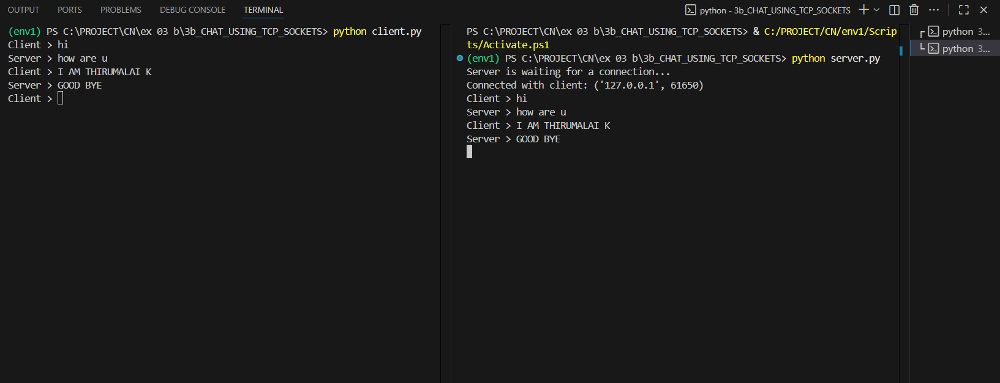

# 3b.CREATION FOR CHAT USING TCP SOCKETS
## AIM
To write a python program for creating Chat using TCP Sockets Links.
## ALGORITHM:
1. Import the necessary modules in python
2. Create a socket connection to using the socket module.
3. Send message to the client and receive the message from the client using the Socket module in
 server
4. Send and receive the message using the send function in socket.
## PROGRAM
### SERVER.PY

```PYTHON
import socket

s = socket.socket()

s.bind(('localhost', 8000))

s.listen(5)
print("Server is waiting for a connection...")


c, addr = s.accept()
print(f"Connected with client: {addr}")


while True:
 
    ClientMessage = c.recv(1024).decode()
    print("Client >", ClientMessage)

 
    if ClientMessage.lower() == 'exit':
        print("Client disconnected. Closing connection.")
        break

  
    msg = input("Server > ")
    c.send(msg.encode())

  
    if msg.lower() == 'exit':
        print("Server disconnected.")
        break

c.close()
```
### CLIENT.PY
```PYTHON
import socket


s = socket.socket()


s.connect(('localhost', 8000))

while True:
    msg = input("Client > ")              
    s.send(msg.encode())                   

    response = s.recv(1024).decode()       
    print("Server >", response)

```
## OUPUT

## RESULT
Thus, the python program for creating Chat using TCP Sockets Links was successfully 
created and executed.
